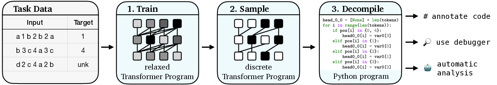

# Learning Transformer Programs

This repository contains the code for our paper, [Learning Transformer Programs](https://arxiv.org/abs/2306.01128).
The code can be used to train a modified Transformer to solve a task, and then convert it into a human-readable Python program.
The repository also includes a number of [example programs](#Example-programs), which we learned for the tasks described in the paper.
Please see [our paper](https://arxiv.org/abs/2306.01128) for more details.




## Quick links
* [Setup](#Setup)
* [Learning Programs](#Learning-programs)
  * [Training](#Training)
  * [Converting to code](#Converting-to-code)
* [Example Programs](#Example-programs)
* [Questions?](#Questions)
* [Citation](#Citation)

## Setup

Install [PyTorch](https://pytorch.org/get-started/locally/) and then install the remaining requirements: `pip install -r requirements.txt`.
This code was tested using Python 3.8 and PyTorch version 1.13.1.

In our experiments on NLP tasks, we initialize word embeddings using 300-dimensional pre-trained GloVe embeddings, which can be downloaded [here](https://github.com/stanfordnlp/GloVe) (Common Crawl, cased):
```bash
mkdir data
wget https://huggingface.co/stanfordnlp/glove/resolve/main/glove.840B.300d.zip -P data/
unzip data/glove.840B.300d.zip
```

## Learning Programs

### Training

The code to learn a Transformer Program can be found in [src/run.py](src/run.py).
For example, the following command will train a Transformer Program for the `sort` task, using two layers, four categorical attention heads per-layer, and one-hot input embeddings:
```bash
python src/run.py \
     --dataset "sort" \
     --vocab_size 8 \
     --dataset_size 10000 \
     --min_length 1 \
     --max_length 8 \
     --n_epochs 250 \
     --batch_size 512 \
     --lr "5e-2" \
     --n_layers 2 \
     --n_heads_cat 4 \
     --n_heads_num 0 \
     --n_cat_mlps 1 \
     --n_num_mlps 0 \
     --one_hot_embed \
     --count_only \
     --seed 0 \
     --save \
     --save_code \
     --output_dir "output/sort";
```
This command will train a Transformer Program for the CoNLL 2003 named-entity recognition task, learning input embeddings composed of four 32-dimensional categorical variables:
```bash
python src/run.py \
     --dataset "conll_ner" \
     --vocab_size 10000 \
     --min_length 1 \
     --max_length 32 \
     --n_epochs 50 \
     --batch_size 32 \
     --lr "5e-2" \
     --n_vars_cat 4 \
     --d_var 32 \
     --n_layers 2 \
     --n_heads_cat 4 \
     --n_heads_num 0 \
     --n_cat_mlps 1 \
     --n_num_mlps 0 \
     --mlp_vars_in 2 \
     --count_only \
     --seed 0 \
     --replace_numbers 1 \
     --glove_embeddings "data/glove.840B.300d.txt" \
     --do_glove 1 \
     --save \
     --save_code \
     --output_dir "output/conll";
```
Please see [src/run.py](src/run.py) for all of the possible arguments.
The training data will either be generated (for the RASP tasks) or downloaded from [Hugging Face Datasets](https://huggingface.co/datasets); see [src/utils/data_utils.py](src/utils/data_utils.py) for the supported datasets.
The [scripts](scripts/) directory contains scripts for training Transformer Programs and standard Transformers with the experiment settings used in the paper.

### Converting to code

Run the training script with the `--save_code` flag to convert the model to a Python program at the end of training.
To convert a model that has already been trained, use `src/decompile.py`.
For example,
```bash
python src/decompile.py --path output/sort/ --output_dir programs/sort/
```
`output/sort/` should be the output directory of a training run.

# Example Programs

The [programs](programs/) directory contains example programs for small-scale versions of all of the [RASP tasks](https://arxiv.org/abs/2106.06981), as well as named-entity recognition.
Each program defines a function called `run` that takes a sequence of tokens as input and returns a list of predicted labels.
For example:
```pycon
>>> from programs.rasp.sort import sort
>>> sort.run(["<s>", "3", "1", "4", "2", "4", "0", "</s>"])
['<s>', '0', '1', '2', '3', '4', '4', '</s>']
```
[programs/rasp](programs/rasp) contains the best-performing programs for each task, using both categorical and numerical attention heads.
[programs/rasp_categorical_only](programs/rasp_categorical_only) contains the best-performing programs using only categorical variables.
[programs/conll_ner](programs/conll_ner) contains a program for named-entity recognition.

# Questions?

If you have any questions about the code or paper, please email Dan (dfriedman@cs.princeton.edu) or open an issue.

# Citation

```bibtex
@article{friedman2023learning,
    title={Learning {T}ransformer {P}rograms},
    author={Friedman, Dan and Wettig, Alexander and Chen, Danqi},
    journal={arXiv preprint},
    year={2023}
}
```
